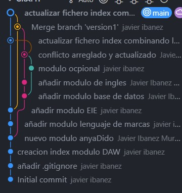

# **REPOSITORIO GITHUB**
## **_Crear 1 rama en pc local_**

## **_Crear 1 rama en remoto_**

## **_Hacer un Merge de las ramas de remoto y local_**

---

## URL de mi repositorio

## haciendo click en el enlace te llevara  ami repositorio

[Ir al repositorio](https://github.com/javierIbanezMurgui/DawAct1_4)

---

### Aqui pongo la imagen final despues de hacer el repositorio con una maquina local y en remoto simulando trabajar juntos 2 usuarios



---

## Bloque de codigo java

```java
public class Markdown {
    public static void main(String[] args) {
        
        System.out.print("Bienvenidos a mi primer codigo Markdown");
    }
}